 

`CS Undergraduate (Junior)` · `ML/DL` · `Flutter Developer` · `On-Device AI`

 

<table>
<tr>
<td align="center" width="50%">

</td>
<td align="center" width="50%">

</td>
</tr>
</table>

<!-- 
  ============================================
  论文通过后直接修改 publications.svg 生成脚本，
  或者在下方用 markdown 添加：
  
  | 1 | Your Paper Title | CVPR 2026 | Accepted | [PDF](link) |
  ============================================
-->

