<div align="center">



<br/>

`ML/DL Researcher` · `Flutter Developer` · `On-Device AI Explorer`

<br/>

[](https://github.com/linyeping)
[](mailto:yepinglin20@gmail.com)

</div>


```
 > ML / DL researcher with hands-on NLP & CV experience.
 > Building intelligent Flutter apps for Android.
 > Currently exploring on-device LLM deployment and AI agents on mobile.
 > Interested in CUDA kernel development and GPU performance optimization.
```


<div align="center">
<table>
<tr>
<td align="center" width="25%">


<br/><br/>
`NLP` `CV`<br/>
`Transformers`<br/>
`Model Optimization`

</td>
<td align="center" width="25%">


<br/><br/>
`Edge LLM`<br/>
`Mobile Inference`<br/>
`Model Quantization`

</td>
<td align="center" width="25%">


<br/><br/>
`Autonomous Agents`<br/>
`Tool Use`<br/>
`Agentic Workflows`

</td>
<td align="center" width="25%">


<br/><br/>
`Kernel Dev`<br/>
`GPU Optimization`<br/>
`Parallel Computing`

</td>
</tr>
</table>
</div>


<div align="center">

**AI / ML**


**Systems & GPU**


**Mobile & App**


</div>


<div align="center">
<table>
<tr>
<td width="50%" valign="top">

<h3 align="center">
  
</h3>
<p align="center">
  <a href="https://github.com/linyeping/GemMate">
    
  </a>
</p>
<p align="center">Your sovereign, zero-cost AI study companion — running Gemma 4 entirely on your own hardware.</p>

</td>
<td width="50%" valign="top">

<h3 align="center">
  
</h3>
<p align="center">
  <a href="https://github.com/linyeping/InSeeVision">
    
  </a>
</p>
<p align="center">基于端侧大模型的视障辅助视觉系统<br/>Edge-AI vision assistance for the visually impaired.</p>

</td>
</tr>
</table>
</div>


> Papers currently under review — links will be added upon acceptance.

| # | Title | Venue | Status | Link |
|:-:|-------|:-----:|:------:|:----:|
| 1 | *Paper Title Placeholder* | — |  | `TBD` |
| 2 | *Paper Title Placeholder* | — |  | `TBD` |
| 3 | *Paper Title Placeholder* | — |  | `TBD` |

<!-- 
  论文通过后在这里更新，格式示例：
  | 1 | Your Paper Title | CVPR 2026 |  | [PDF](link) |
-->


<div align="center">


</div>

<br/>


<div align="center">


</div>
